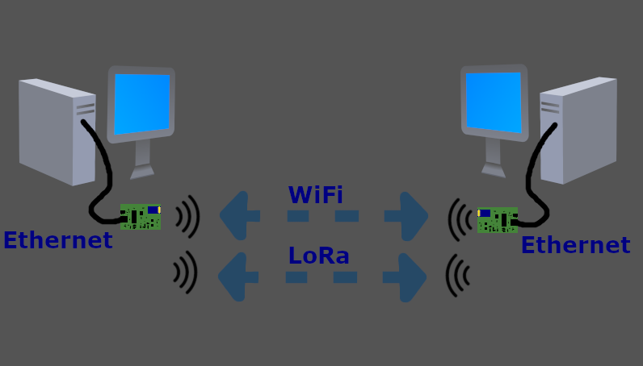
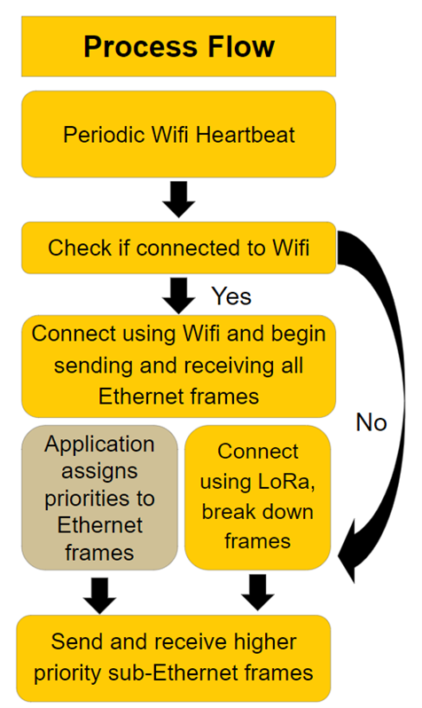
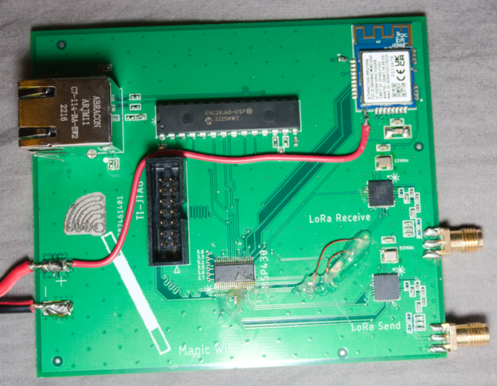

# Magic WiFi

### An ethernet faking WiFi and LoRa host for data transfer without signal.

Magic Wifi is a system that creates a flexible and dependable wireless connection between two devices at variable ranges. All the technology behind Magic Wifi is hidden from the two user devices which believe they are simply connected with an Ethernet cable at both ends. Underneath, Magic Wifi employs both LoRa and Wifi technologies to create a dynamic connection that seamlessly switches between long-range, low-bandwidth rates for critical data like telemetry and short-range, high-bandwidth rates for large data dumps. 

Magic Wifi can be used in various different settings where two devices need to be connected at different distances. One example application is endurance racing, like Le Mans. Critical data is needed at all times to inform the pit crew of components that require maintenance at the next pit stop. High volume data, by contrast, would include detailed engine diagnostics or telemetry logs. The detailed data would be helpful to the technicians during pit stops to complete repairs and tune the cars for future laps but is not as critical.  Racing is not the only important application. For farms in remote areas, cellular coverage can often be poor to non-existent, making internet connectivity scarce outside of the farmer’s home. Magic Wifi provides a low-speed connection over multiple miles so that the farmer can communicate with others inside the house. The close-range connectivity allows the farmer to transfer large volumes of important statistics and pictures of crops without the hassle of removing internal storage cards or connecting Ethernet cables.

magicWiFi implements logic to prioritize data in accordance with the IEEE 802.1Q standard. While so far there is not a completed program that could generate frames with the priority field, we still completed the code on the embedded device to handle this. We successfully implemented the logic to switch between Wifi and LoRa seamlessly.

## Overview

Fig: The initial starting idea and design

The goal of Magic Wifi is to create a flexible and dependable wireless connection with two devices at widely varying ranges. To achieve this, user devices connect via Ethernet and data is sent either over Wifi or LoRa. As Ethernet interfaces are ubiquitous, the product is compatible with virtually all peripherals. Any device attached believes it is connected via a standard ethernet cable to the other side. Wifi transmits data at faster rates over shorter distances, while LoRa handles longer ranges albeit with slower data transmission rates. 

Sending an ethernet frame over LoRa proved difficult due to its low bandwidth and small frame size. As a result a method would be needed to prioritize important data. After consulting Dr. Brian Noble, it was decided that the best approach would be to assign priorities to the Ethernet frames based on what the application decided was the most important information. This brought up a new problem of what to do with any low priority Ethernet frames when switching from Wifi to LoRa. We elected to drop any remaining low priority frames in the ethernet buffer after switching. We did not have enough memory to hold them until there was either a gap in high-priority data or Wifi reconnected. Also the delay would likely be too long for them to be useful to the application, so we would choose to drop them regardless of memory.

Fig: A simplified overview of connections between modules

Magic Wifi’s goal is to create a reliable connection between two clients at variable ranges. It has a low-speed connection for crucial data to be communicated over many miles, as well as a fast-speed mode at closer ranges. To the clients, this appears as an unbroken Ethernet connection, when in reality, they are connected wirelessly through the Magic Wifi boards using either LoRa or Wifi technology (see Figure 1 for diagram of system architecture). 

Ethernet connections were chosen for the project as the interface is so ubiquitous. This way, Magic Wifi is compatible with many different devices. The client is connected with an Ethernet cable to the Ethernet port which leads to the Ethernet controller (ENC28J60). Ethernet frames are sent from the client to the ENC28J60, which holds them in a buffer until processed and sent by the Magic-Wifi device. This module is accessed via the SPI interface by the microcontroller, the Texas Instruments MSP430FR2355. 

The MSP430FR2355 (MSP430) was chosen as the microcontroller for Magic Wifi due to its immediate availability, solderability, four parallel SPI buses, and raw speed. The MSP430 chosen was the highest end MSP430 on the market that matched our specific requirements. This high end MSP430 increased the speed of SPI lines and our GPIO lines above most other MSP430s on the market. With four SPI buses, it allows for a dedicated fast SPI connection to each of the peripherals used in the project, eliminating possible conflicts between devices. While taking in or sending Ethernet data from the ENC28J60, the MSP430 sends data to the other Magic Wifi board using either a Wifi or LoRa connection. The microcontroller sends a “Wifi heartbeat” every four seconds to check whether or not the Wifi chips are within range (see Figure below for program flow).

The Wifi module creates a faster connection (measured at 160 kbps using TCP) at short distances. At the start of the project the goal was to choose a WiFi module with Peer to Peer (P2P) connection as this was a developed method specifically for a use case like ours. However upon further investigation the most affordable WiFi module with P2P was around $20 a board, and $60 for one breadboardable module, it was decided that this was just not affordable in the budget. It was decided among the team that the next best method after P2P was a software access point (SoftAP). SoftAP is a more difficult method as one WiFi module needs to “lead” the other as if it were a router and it would require more work, but it fit the budget and thus this method was chosen. The ATWINC1500 was chosen for the project because of the support for SoftAP, low-cost, and DIY support. The corresponding board connects to the SoftAP as a client and the two can send data as raw frames. A single Wifi frame can always encapsulate an entire Ethernet frame, making it fairly easy to send and receive with existing libraries. As the Wifi chips are full-duplex, only one was required per board. Whenever Wifi is unavailable, LoRa is used instead.

The LoRa connection is used to connect two Magic Wifi boards, theoretically up to several kilometers, albeit at a lower bandwidth (measured at 6 kbps using TCP). The LoRa mode allows for important, high-priority information to be sent. The SX1272 LoRa transceiver chips were chosen as they allowed for low-level control of LoRa which many competing chips lack as they are designed for LoRaWAN which is too high level for this project. Unlike the Wifi chips, the LoRa transceivers were half-duplex. As a result, two LoRa transceivers are placed on each Magic Wifi board where one is designated for sending data and the other is tasked with receiving to avoid implementing our own time-sharing algorithm. Due to LoRa’s slower connection speeds, we needed to prioritize important data. 

It was decided that the best option would be to prioritize certain Ethernet frames. The application would decide the priorities of each Ethernet frame using the standard IEEE 802.1Q tags (See Figure Below). The Magic Wifi board would send and receive only higher priority Ethernet frames that were designated to have the most important information.

Fig: Program Flow

## Building the Project

The PCB design and Bill of Materials are being redesigned. There is no release version of the PCB at present moment.

## Setting up a dev environment

All necessary components for purchase are listed in [docs/BillsOfMaterials/Breadboard-BOM](BillsOfMaterials/Breadboard-BOM.md)

The base MCU for Magic WiFi is the MSP430-FR2355-TDBTR. The code for all Texas Instruments systems run off their proprietary version of Eclipse IDE, [CCStudio](https://www.ti.com/tool/CCSTUDIO).

To work on this code and produce a release version of the flash you must install [CCStudio](https://www.ti.com/tool/CCSTUDIO).
After installing CCStudio, there are multiple add-ons that are necessary to begin development on the project.

On the getting started page, click the link that goes to the App Center.
In the App Center, select to add-ons
- MSP430 GCC
- MSP430 Compiler

After installing these, open the codebase by File->Open Projects from FileSystem.
Navigate to the magic-wifi/magicwifi folder. After selecting it, select finish to open the project.

In the project there are folders for each major component and some necessary base folders.

|   Folder      |  Info        |
|---------------|--------------|
| incldes | Necessary header and include folders for library functions |
|  ATWINC1500_MSP   | All necessary driver information for the ATWINC WiFi module |
| Debug | When a debug build is made the Debug folder is filled with necessary binaries and items |
| driverlib | Contains main libraries for divers for the MSP430 included by the includes folders |
| EtherCard_MSP430FR2355 | A custom ported version of the Arduino EtherCard Library, as only minimal functionality is needed and space on the MSP430 ROM chip is limited, only necessary parts of the library were ported |
| FrameTranslator | A class called FrameTranslator, that translates Ethernet frames into LoRa packets adding parity and consistency |
| LoRaRF_2.1.1_driver | Contains headers and classes to run the LoRa RF modules more smoothly in the main code driver |
| targetConfigs | A base level configuration for CCStudio to build for the MSP430FR2355 |
| defines.h | A number of const items that are used throughout the project. |
| lnk_msp430fr2355.cmd | A linker file produced by CCStudio, no need to touch this file |
| main.cpp | The main project and running codebase that builds from all other parts |

To build and load the project, go to Project-> Build Project, proceed past the efficiency warnings. Afterward you can plug in your TI Dev Board and select Run-> Load.
On the first load you must Select program to load, choose Browse project and navigate to debug-> magicwifi.out

This should flash your firmware correctly.

## Developing on PCB

### NOTE: PCB is under redevelopment on KiCAD from Eagle and is therefore not stable to be produced.

Fig: An image of Version 1.2 of the MagicWiFi PCB, the first working version with modifications.

If you a developing on a PCB version of MagicWiFi, to Flash binaries built for MSP430 you will need the [MSP430 Flasher](https://www.ti.com/tool/MSP430-FLASHER), and a TI JTAG flashing device to flash firmware to the MSP430.

All necessary Components are listed in [docs/BillsOfMaterials/PCB-BOM](docs/BillsOfMaterials/PCB-BOM.md)

### Major Issues

One major issue is At time of writing Jan 10, 2024. The ATWINC1500 modules for sale on DigiKey have an earlier version of firmware than is necessary. On the module there is not a method of flashing new firmware. This was overcome in the development process by desoldering the ATWINC1500 from the module and soldering on an ATWINC1500 from a dev board that could have the firmware updated. A new method must be decided upon as this requires more specialized tools and is not user friendly.
